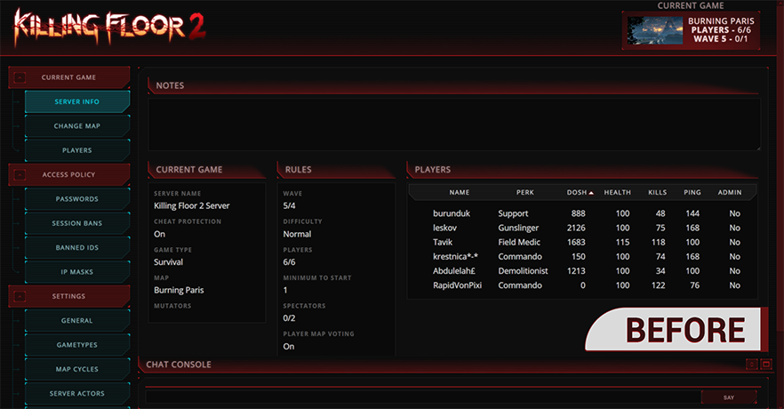
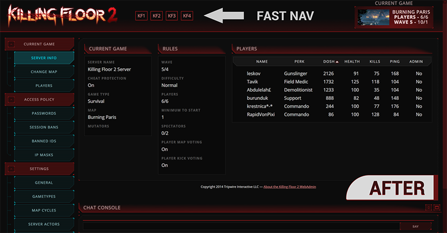
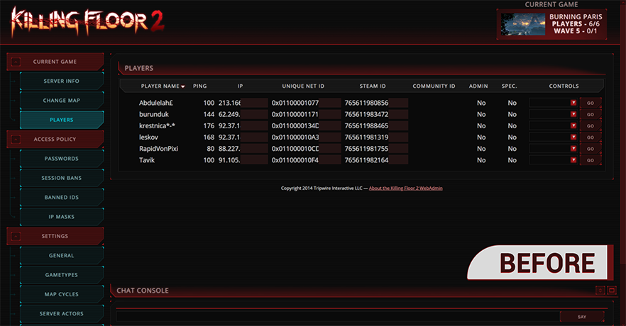
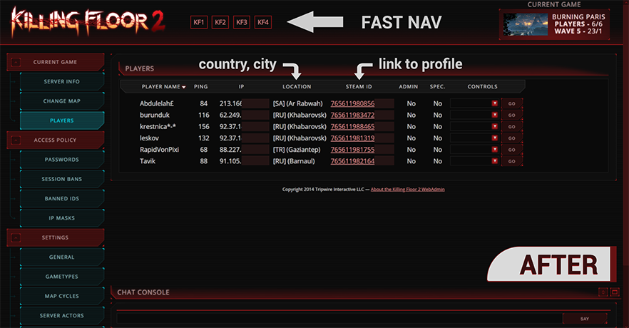

# Killing Floor 2 | Web Admin Tweaks

#### Modifications
- Fast navigation buttons to any other servers;
- Hidden block of **Notes** on **Server Info** page;
- Hidden columns of **Unique Net ID** and **Community ID** on **Players** page;
- Added **Location** (country, city) and link to **Steam Profile** on **Players** page;

---

#### Installation
1. Overwrite server files by files from this repository.

	**From:** `Repository Folder`/KFGame/Web/ServerAdmin/
	**To:** `KF2  Server Folder`/KFGame/Web/ServerAdmin/

2. Edit file **header_fastnav.inc** and change IP addresses and ports.

```html
<div id="fastnav">
	<a href="http://123.123.123.123:7790/ServerAdmin/current/info">KF1</a>
	<a href="http://123.123.123.123:7791/ServerAdmin/current/info">KF2</a>
	<a href="http://123.123.123.123:7792/ServerAdmin/current/info">KF3</a>
	<a href="http://123.123.123.123:7793/ServerAdmin/current/info">KF4</a>
</div>
```

Notes:
>You can do all of this steps even on running server.
>Simply reload web page in your browser to see changes.

---

#### Comparsion screenshots

##### Server Info





##### Players



